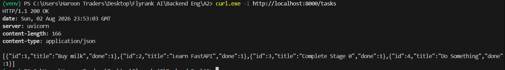
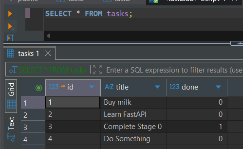
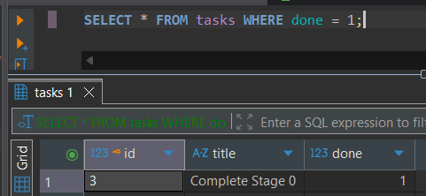
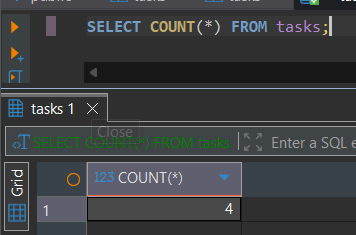
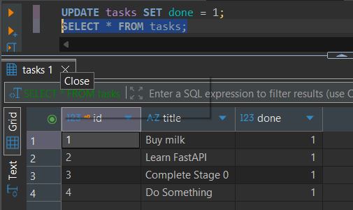
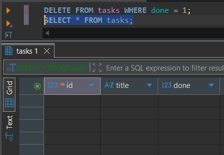
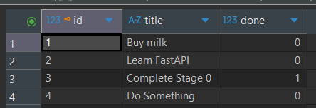
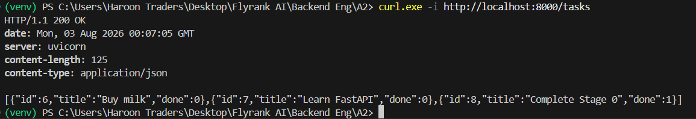
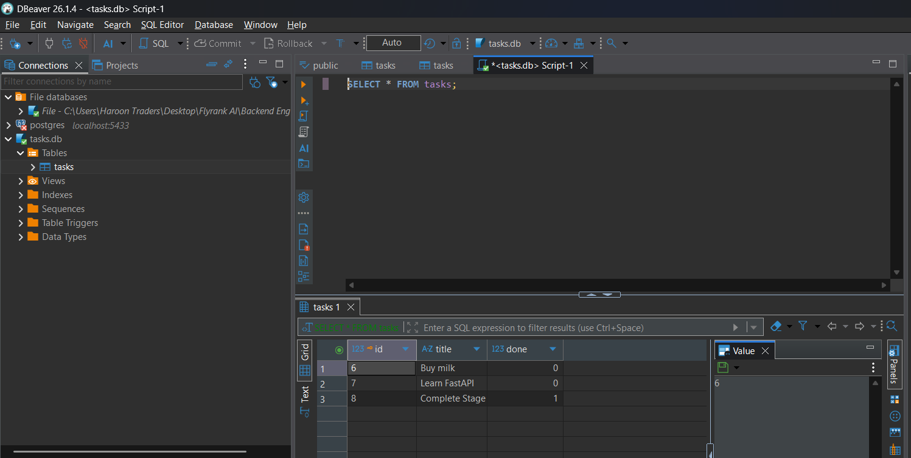

# Task API

A CRUD API for managing a to-do list, built with **FastAPI** and backed by a **SQLite** database. Started as an in-memory API (Assignment 1) and was upgraded to persistent SQLite storage (Assignment 2) — the endpoints, request/response shapes, and status codes never changed; only the storage layer underneath did.

## Database

This project uses **SQLite** for storage, chosen because:
- It requires no separate database server or installation — the entire database is a single file
- It ships as part of Python's standard library (`sqlite3`) — nothing extra to install
- It's more than enough for a small project like this, where the main goal is proving data survives a restart

`tasks.db` is created automatically in the project root the first time the app runs. It's git-ignored, so every fresh clone starts with a clean, auto-seeded database — nobody needs to set anything up by hand.

## How to run

1. Clone this repo
2. Create and activate a virtual environment:
   ```
   python -m venv venv
   venv\Scripts\Activate.ps1
   ```
3. Install dependencies:
   ```
   pip install fastapi uvicorn
   ```
4. Start the server:
   ```
   uvicorn main:app --reload --port 8000
   ```
5. The database (`tasks.db`) and its `tasks` table are created automatically on first run, seeded with 3 example tasks.
6. Visit `http://localhost:8000/docs` for interactive Swagger UI.

## Endpoints

| Method | Path         | Description                        |
|--------|--------------|-------------------------------------|
| GET    | /            | API info                            |
| GET    | /health      | Health check                        |
| GET    | /tasks       | List all tasks                      |
| GET    | /tasks/{id}  | Get one task by id                  |
| POST   | /tasks       | Create a new task                   |
| PUT    | /tasks/{id}  | Update a task's title and/or done   |
| DELETE | /tasks/{id}  | Delete a task                       |

## Validation & status codes

| Scenario                          | Status |
|------------------------------------|--------|
| Successful read                    | 200    |
| Successful create                  | 201    |
| Successful delete                  | 204    |
| Missing/empty title on create      | 400    |
| Empty body or empty title on update| 400    |
| Unknown task id                    | 404    |

## Example request

```
curl.exe -i -X POST http://localhost:8000/tasks -H "Content-Type: application/json" -d "@body.json"
```

```
HTTP/1.1 201 Created
content-type: application/json

{"id":1,"title":"Buy milk","done":0}
```

## Persistence proof

Unlike Assignment 1, task data now survives a server restart:
1. Create a task via `POST /tasks`
2. Stop the server (`Ctrl+C`)
3. Restart it (`uvicorn main:app --reload --port 8000`)
4. `GET /tasks` — the task is still there

## Stage checkpoints (screenshots & outputs)

### Stage 0 — Create your database
Restarted the app 3 times and confirmed the `tasks` table always shows exactly 3 seeded tasks — no duplicates.

### Stage 1 — Read from the database
`GET /tasks` returns all tasks from SQLite; `GET /tasks/{id}` returns one task or a `404` for an unknown id.


### Stage 2 — Create new tasks
`POST /tasks` inserts a row into SQLite. Created a task, restarted the server, and confirmed it was still there via `GET /tasks` — proof of persistence.

### Stage 3 — Update and delete
`PUT /tasks/{id}` and `DELETE /tasks/{id}` now run SQL `UPDATE`/`DELETE`. Verified the full cycle: create → update → delete → confirm gone.

### Stage 4 — Explored SQLite by hand
Opened `tasks.db` in DB Browser for SQLite and ran manual queries (see below). Confirmed changes appeared instantly through the API with no restart.









### Stage 5 — Database documentation
Final clean-clone check: deleted `tasks.db`, restarted the server, and confirmed it recreated the database and reseeded 3 tasks automatically.



## Exploring the database directly

The database can be opened and queried directly using [DB Browser for SQLite](https://sqlitebrowser.org/dl/) — since the API and DB Browser both read the same `tasks.db` file, changes made in one are immediately visible in the other, with no restart or syncing needed.

### Database viewer



## Tech stack

- Python 3.10+
- FastAPI
- SQLite (via Python's built-in `sqlite3` module)
- Uvicorn (ASGI server)
